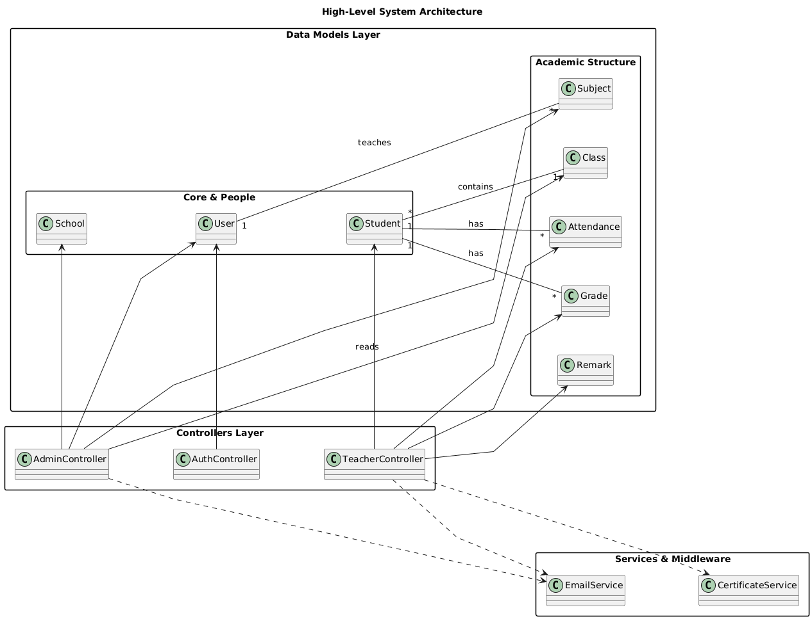
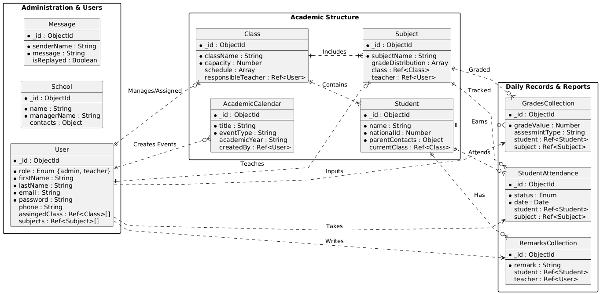
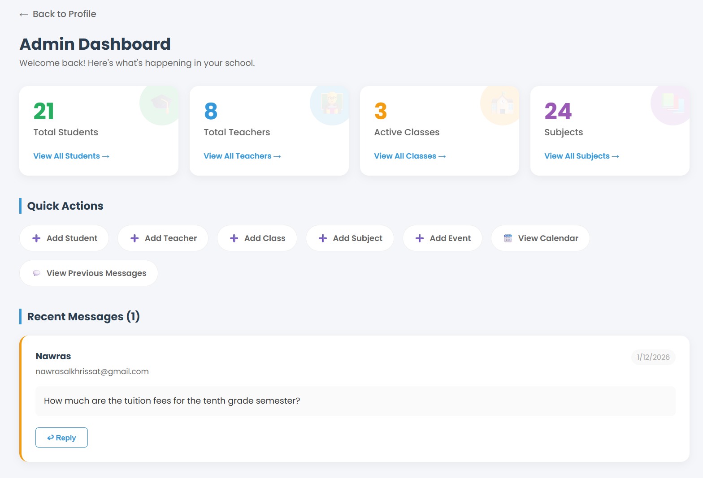
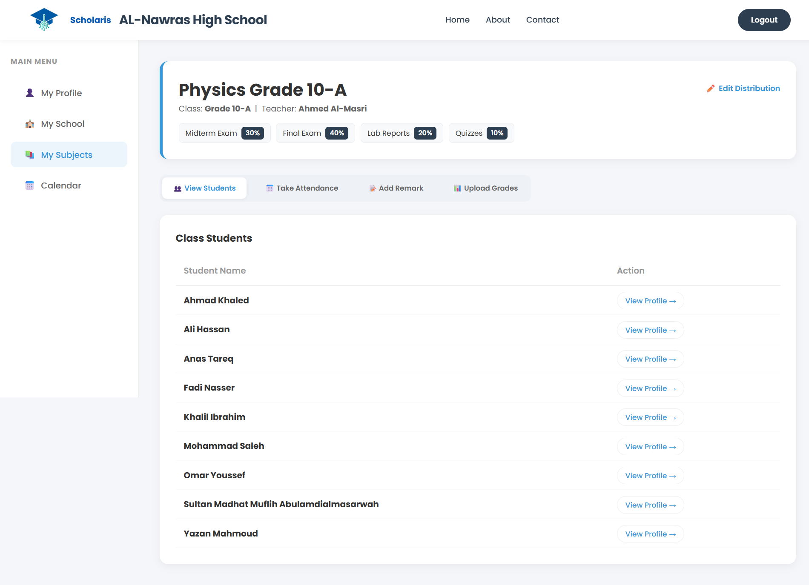
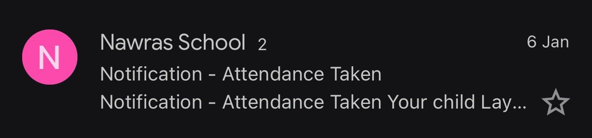
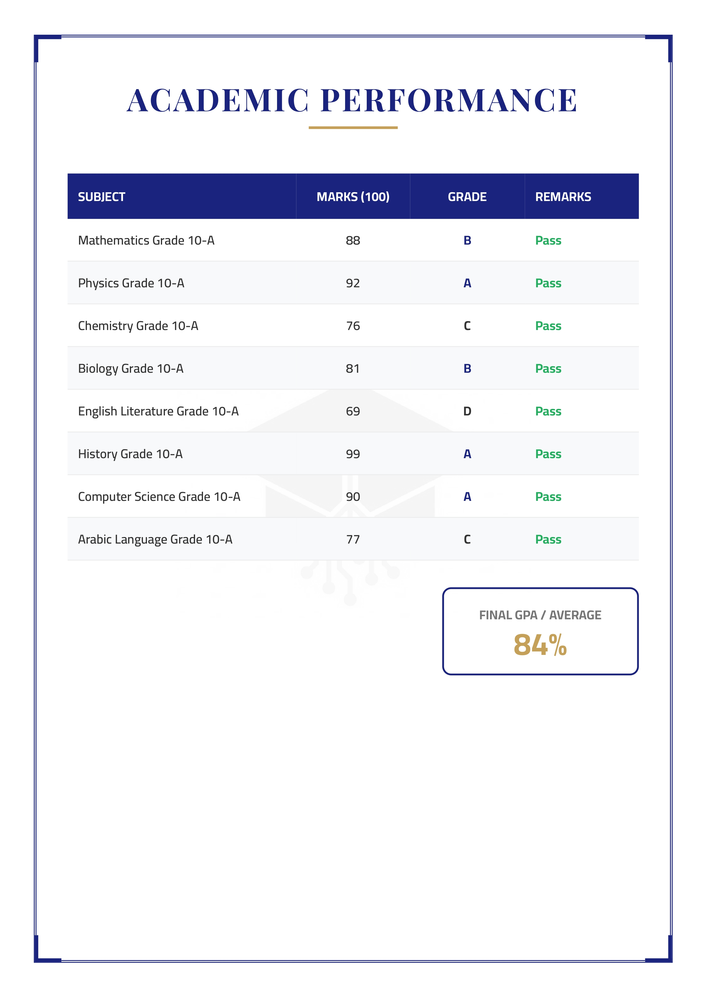

# 🎓 Scholaris - Smart School Management System

**A comprehensive, centralized platform automating academic administration and bridging the communication gap between schools and parents.**

[View Demo](#) · [Report Bug](issues) · [Request Feature](issues)

---

## 📖 Table of Contents
- [About the Project](#-about-the-project)
- [Key Features](#-key-features)
- [System Architecture](#-system-architecture)
- [Tech Stack](#-tech-stack)
- [Security Implementation](#-security-implementation)
- [Getting Started](#-getting-started)
- [Screenshots](#-screenshots)
- [Future Roadmap](#-future-roadmap)
- [Contact](#-contact)

---

## 💡 About the Project

**Scholaris** was born out of the need to modernize traditional school administration. Many institutions still rely on fragmented data (Excel sheets, paper records), leading to communication gaps and security risks.

**Scholaris** solves this by providing a unified web-based ecosystem that digitizes student records, automates daily workflows (attendance, grading), and ensures data integrity through secure, role-based access.

### 🚀 Why Scholaris?
- **Efficiency:** Replaces manual paperwork with one-click digital solutions.
- **Transparency:** Parents receive real-time updates, eliminating end-of-semester surprises.
- **Security:** Advanced encryption strategies to protect sensitive student data.

---

## ✨ Key Features

### 🏛️ For Administrators
- **Full Infrastructure Management:** Manage academic years, classes, and subjects.
- **User Management:** Create/Edit Student & Teacher accounts with RBAC.
- **Dashboard Analytics:** Visual insights into school performance.

### 👨‍🏫 For Teachers
- **Digital Grading Book:** Seamless input of marks with auto-calculation.
- **Smart Attendance:** Quick "Present/Absent/Late" marking.
- **Behavioral Remarks:** Add notes directly to student profiles.

### 👨‍👩‍👧 For Parents & Students
- **Real-Time Notifications:** Automated emails via **Nodemailer** for absence or new grades.
- **Official Transcripts:** One-click generation of tamper-proof PDFs using **Playwright**.
- **Performance Tracking:** View detailed grade breakdowns and attendance history.

---

## 🏗️ System Architecture

Scholaris follows a **Modular MVC (Model-View-Controller)** architecture to ensure separation of concerns and scalability.

 The database is designed with **MongoDB** to handle complex relationships between Students, Classes, and Academic Records efficiently.

 ---

## 🛠️ Tech Stack

| Category | Technologies |
|----------|--------------|
| **Backend** | Node.js, Express.js (RESTful API principles) |
| **Database** | MongoDB, Mongoose (Complex Schema Design) |
| **Frontend** | EJS Templating Engine, CSS3 (Responsive Design) |
| **Security** | JWT (Auth), Bcrypt (Hashing), Helmet (Headers) |
| **Automation** | Nodemailer (SMTP), Playwright (Headless Browser for PDFs) |

---

## 🔒 Security Implementation

Security was a primary focus during the development of Scholaris. Key measures include:

1.  **Password Protection (Bcrypt & Salting):**
    - Implemented a robust hashing strategy using **Salt rounds**.
    - Prevents **Rainbow Table Attacks**; even if two users have the same password (e.g., `123456`), their stored hashes are completely different.

2.  **Role-Based Access Control (RBAC):**
    - Strict middleware ensures `Students` cannot access `Teacher` routes, and `Teachers` cannot modify `Admin` settings.

3.  **Data Integrity:**
    - Server-side validation to prevent logic errors (e.g., grades > 100).

---
## 📸 Screenshots

### System Dashboards

| Admin Dashboard | Teacher Portal |
|:---:|:---:|
|  |  |

| Email Notification |
|:---:|
|  |

---

### 📜 Official Transcript Examples (PDF Output)

Here are examples of the tamper-proof PDF transcripts generated by the system.

   

---

## 🔮 Future Roadmap

I am actively working on the next phase of Scholaris:

- [ ] **Frontend Migration:** Rebuilding the UI with **React.js** for a Single Page Application (SPA) experience.
- [ ] **Mobile App:** Developing a cross-platform app using **React Native**.
- [ ] **AI Integration:** Implementing predictive analytics for student performance.
